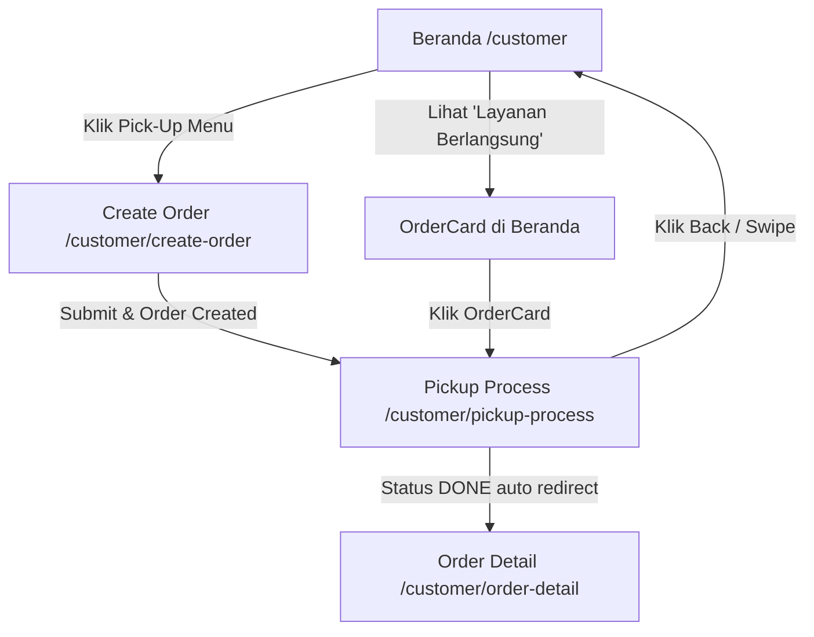

# Refactor Pickup Process: Bottom Sheet → Dedicated Page

## Latar Belakang

Saat ini, proses pickup (mencari cleaner, cleaner menuju lokasi, sampah diangkut) ditampilkan dalam **BottomSheet** yang melapisi halaman `create-order`. Hal ini menyebabkan user **tidak bisa kembali ke halaman beranda** selama proses berlangsung karena terperangkap di dalam flow bottom sheet.

### Masalah Utama
1. Bottom sheet pada pickup-process mengunci user di halaman `create-order`
2. User tidak bisa navigasi ke beranda saat proses pickup sedang berjalan
3. Tidak ada representasi "layanan berlangsung" yang interaktif di halaman beranda

### Solusi
1. Pindahkan konten bottom sheet pickup-process ke **dedicated page** (`/customer/pickup-process`)
2. Tambahkan **OrderCard** di halaman beranda ("Layanan Berlangsung") yang terhubung ke data real dari Supabase
3. OrderCard di beranda bisa di-klik untuk navigasi ke halaman pickup-process

---

## Arsitektur Saat Ini

```
/customer (beranda)
  └── components/OnGoingSection.tsx  ← hardcoded, tidak fetch data
  └── components/OrderCard.tsx       ← hardcoded, tidak dinamis

/customer/create-order
  └── layout.tsx                     ← parallel route: children + @pickup
  └── page.tsx                       ← form create order
  └── @pickup/
      └── default.tsx                ← returns null
      └── pickup-process/
          └── page.tsx               ← BottomSheet overlay (MASALAH)
```

## Arsitektur Yang Diusulkan

```
/customer (beranda)
  └── components/OnGoingSection.tsx  ← UBAH: fetch ongoing orders dari Supabase
  └── components/OrderCard.tsx       ← UBAH: terima props, navigasi ke pickup-process

/customer/create-order
  └── layout.tsx                     ← SEDERHANAKAN: hapus parallel route @pickup
  └── page.tsx                       ← UBAH: redirect ke /customer/pickup-process setelah submit

/customer/pickup-process              ← BARU: dedicated page (bukan bottom sheet)
  └── page.tsx                       ← konten dari pickup-process tapi sebagai full page
```

---

## Proposed Changes

### 1. Buat Dedicated Page: `/customer/pickup-process`

#### [NEW] `src/app/(restricted-page)/customer/pickup-process/page.tsx`

- Pindahkan logika dari `@pickup/pickup-process/page.tsx` ke sini
- **Hapus BottomSheet wrapper**, ganti dengan layout halaman penuh
- Tambahkan `ServiceHeader` dengan tombol back ke `/customer`
- Pertahankan seluruh logika status tracking (WAITING → ONPROGRESS → DONE)
- Pertahankan useEffect timer untuk simulasi status progression
- Pertahankan informasi cleaner (nama, icon call/message)
- Setelah DONE, redirect ke `/customer/order-detail?orderId=...`

**Layout halaman baru:**
```
┌──────────────────────────┐
│ ← Pick-Up Process        │  ← ServiceHeader (back to /customer)
├──────────────────────────┤
│                          │
│   [Map Component]        │  ← Opsional: tampilkan peta lokasi
│                          │
├──────────────────────────┤
│                          │
│   Status Card            │
│   "Sedang Mencari..."    │
│   "Estimasi 15 menit"   │
│                          │
│   ───────────────        │
│   👤 Cleaner TrashHub    │
│      Cleaner             │
│              📞  💬      │
│                          │
└──────────────────────────┘
```

---

### 2. Ubah Redirect Setelah Create Order

#### [MODIFY] `src/app/(restricted-page)/customer/create-order/page.tsx`

- Ubah redirect dari:
  ```
  /customer/create-order/pickup-process?...
  ```
  menjadi:
  ```
  /customer/pickup-process?orderId=...
  ```
- Hapus parameter `_lat` dan `_long` dari URL (tidak digunakan di pickup-process)

---

### 3. Hapus Parallel Route `@pickup`

#### [DELETE] `src/app/(restricted-page)/customer/create-order/@pickup/` (seluruh folder)

- Hapus `@pickup/default.tsx`
- Hapus `@pickup/pickup-process/page.tsx`
- Parallel route ini tidak diperlukan lagi

#### [MODIFY] `src/app/(restricted-page)/customer/create-order/layout.tsx`

- Sederhanakan layout: hapus prop `pickup` dari parallel route
- Render hanya `{children}`

#### [DELETE] `src/app/(restricted-page)/customer/create-order/default.tsx`

- File ini tidak diperlukan lagi karena parallel route dihapus

---

### 4. Buat Hook untuk Fetch Ongoing Orders

#### [NEW] `src/hooks/services/CustomerOrders/service.ts` (tambah query)

Tambahkan hook `useGetOngoingOrders`:
```ts
export const useGetOngoingOrders = createQuery({
  queryKey: ["ongoing-orders"],
  fetcher: async (variable: { customerId: string }) => {
    const supabase = createClient()
    const { data, error } = await supabase
      .from("customer_orders")
      .select("*")
      .eq("customerId", variable.customerId)
      .in("status", ["WAITING", "ONPROGRESS"])
      .order("createdDate", { ascending: false })

    if (error) throw error
    return data as (CreateOrderType & { id: string })[]
  },
})
```

Export hook ini dari `index.ts`.

---

### 5. Update `OnGoingSection` dengan Data Real

#### [MODIFY] `src/app/(restricted-page)/customer/components/OnGoingSection.tsx`

- Terima `customerId` sebagai prop (atau ambil dari AuthProvider)
- Panggil `useGetOngoingOrders` untuk fetch data ongoing
- Render daftar `OrderCard` berdasarkan data real
- Tampilkan section hanya jika ada ongoing orders
- Tambahkan empty state jika tidak ada

---

### 6. Update `OrderCard` agar Dinamis

#### [MODIFY] `src/components/OrderCard/OrderCard.tsx`

- Terima props:
  ```ts
  type OrderCardProps = {
    orderId: string
    status: "WAITING" | "ONPROGRESS"
    addressName?: string
    cleanerName?: string
  }
  ```
- Mapping status ke label:
  - `WAITING` → "Mencari cleaner..."
  - `ONPROGRESS` → "Cleaner menuju lokasi"
- Klik OrderCard → navigasi ke `/customer/pickup-process?orderId=...`

---

### 7. Update `customer/page.tsx` (Beranda)

#### [MODIFY] `src/app/(restricted-page)/customer/page.tsx`

- Pass `userId` atau `customerId` ke `OnGoingSection`
- Pastikan data user sudah tersedia sebelum render

---

## File yang Terdampak (Ringkasan)

| Aksi     | File                                                                 |
|----------|----------------------------------------------------------------------|
| **NEW**  | `src/app/(restricted-page)/customer/pickup-process/page.tsx`        |
| MODIFY   | `src/app/(restricted-page)/customer/create-order/page.tsx`          |
| MODIFY   | `src/app/(restricted-page)/customer/create-order/layout.tsx`        |
| DELETE   | `src/app/(restricted-page)/customer/create-order/@pickup/` (folder) |
| DELETE   | `src/app/(restricted-page)/customer/create-order/default.tsx`       |
| MODIFY   | `src/hooks/services/CustomerOrders/service.ts` (tambah hook)        |
| MODIFY   | `src/hooks/services/CustomerOrders/index.ts` (export hook baru)     |
| MODIFY   | `src/app/(restricted-page)/customer/components/OnGoingSection.tsx`   |
| MODIFY   | `src/components/OrderCard/OrderCard.tsx`                            |
| MODIFY   | `src/app/(restricted-page)/customer/page.tsx`                       |

---

## User Flow Setelah Refactor



**Keuntungan:**
1. ✅ User bisa **kembali ke beranda** kapan saja selama proses pickup
2. ✅ Ada **OrderCard** di beranda yang menampilkan status pickup yang sedang berjalan
3. ✅ Klik OrderCard di beranda → langsung ke halaman pickup-process
4. ✅ Arsitektur lebih bersih — tidak perlu parallel route `@pickup`

---

## Verification Plan

### Manual Verification
1. Buat order baru → pastikan redirect ke `/customer/pickup-process`
2. Di halaman pickup-process, tekan tombol back → pastikan kembali ke beranda
3. Di beranda, pastikan "Layanan Berlangsung" menampilkan OrderCard dengan status real
4. Klik OrderCard → pastikan navigasi ke pickup-process dengan orderId yang benar
5. Tunggu proses selesai (DONE) → pastikan auto-redirect ke order-detail
6. Setelah order selesai, pastikan OrderCard hilang dari beranda

### Build Check
```bash
npm run build
```

---

## Design Guidelines (Skill: `frontend-design`)

> Referensi: `~/.agents/skills/frontend-design/SKILL.md`

Seluruh perubahan UI pada refactor ini **harus mengikuti panduan dari skill `frontend-design`**. Berikut penerapannya pada masing-masing komponen:

### Prinsip Umum

1. **Ground it in the subject** — TrashHub adalah layanan pickup sampah. Desain harus mencerminkan identitas brand: bersih, ramah lingkungan, dan terpercaya. Warna utama `#309C7A` (brand green) sudah tepat, pastikan konsisten.
2. **Typography carries personality** — Gunakan type scale yang jelas dan konsisten. Heading semibold, body normal, subtitle dengan warna `gray-500`. Jangan campur ukuran font secara sembarangan.
3. **Leverage motion deliberately** — Transisi antar status (WAITING → ONPROGRESS → DONE) harus menggunakan animasi yang bermakna, bukan sekadar fade. Contoh: progress indicator, ikon bergerak saat "menuju lokasi".
4. **Restraint** — Habiskan keberanian desain di satu tempat. Untuk halaman pickup-process, signature element-nya adalah **status progress visual** — buat itu menonjol, sisanya tetap tenang.

### Penerapan per Komponen

#### Pickup Process Page (dedicated page baru)
- **Brainstorm dulu sebelum coding**: Buat design plan ringkas (palette, type, layout, signature) sebelum implementasi
- **Status card** sebagai focal point — gunakan variasi visual per status:
  - `WAITING`: animasi pulse/loading, warna muted
  - `ONPROGRESS`: ikon truk bergerak, warna brand aktif, info cleaner muncul
  - `DONE`: checkmark animasi, warna sukses
- **Layout**: ServiceHeader di atas, konten status di tengah, info cleaner di bawah
- **Copy yang purposeful**: "Sedang Mencari Cleaner Terdekat..." → aktif, langsung. Hindari copy yang terasa generik

#### OrderCard di Beranda
- **Structure is information** — Jangan gunakan numbering dekoratif. Tampilkan: ikon status, label status, nama alamat, nama cleaner
- **Hover/tap state** yang responsif — berikan feedback visual saat di-tap
- **Empty state** yang memberi arah: jika tidak ada layanan berlangsung, tampilkan pesan yang mengajak user untuk memesan pickup, bukan sekadar kosong

#### Panduan Copy (Writing in Design)
- Gunakan active voice: "Cleaner menuju lokasi" ✅ bukan "Lokasi Anda sedang dituju" ❌
- Error state: jelaskan apa yang salah + cara fix, tanpa minta maaf
- Label konsisten: kalau tombol bilang "Pesan Pick-Up", toast/notif juga bilang "Pick-Up Dipesan"
- Sentence case untuk semua label UI

### Process Checklist (dari skill)
- [ ] Brainstorm design plan (palette, type, layout, signature) sebelum coding
- [ ] Review plan: apakah ada bagian yang terasa "template default"? Revisi jika ya
- [ ] Implementasi mengikuti revised plan
- [ ] Self-critique: ambil screenshot, evaluasi apakah desain terasa unik untuk TrashHub
- [ ] Pastikan responsive (mobile-first), keyboard focus visible, reduced motion respected
